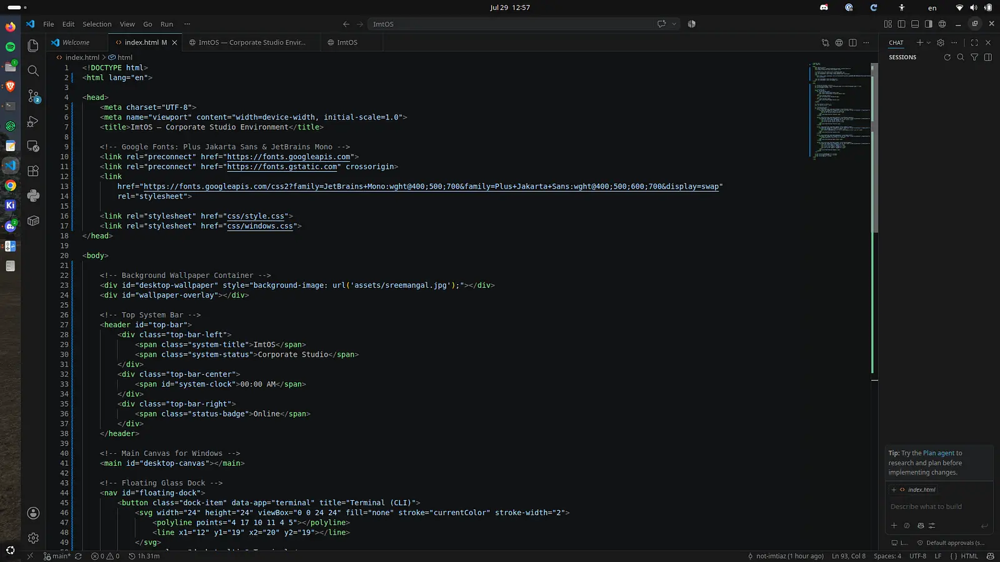
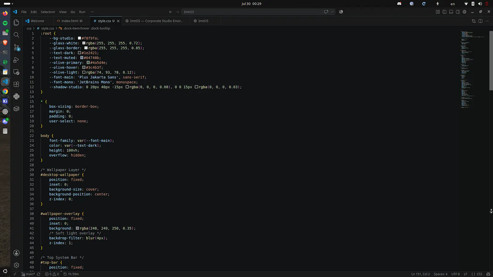
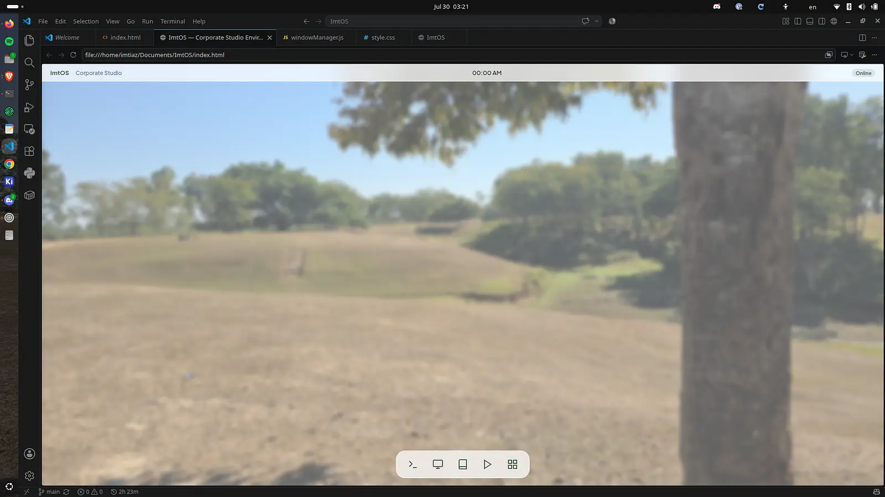
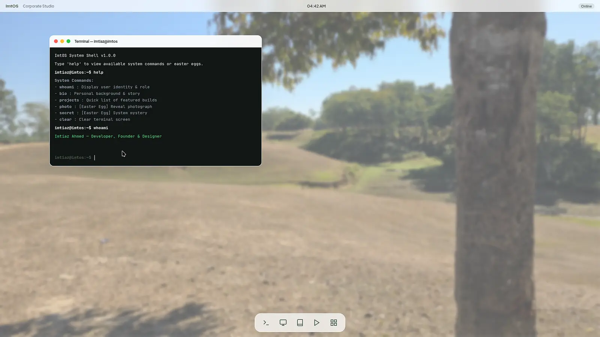
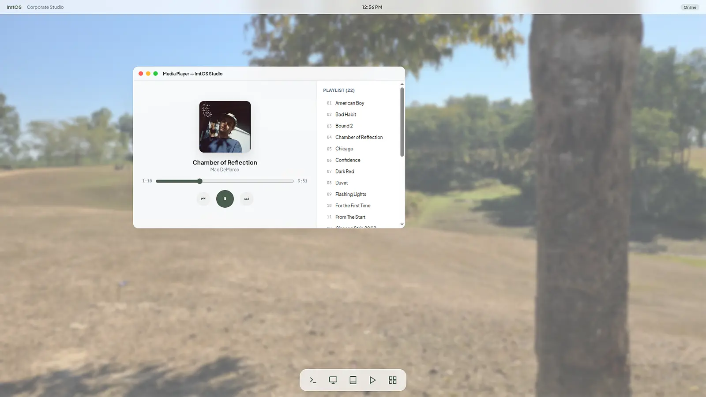
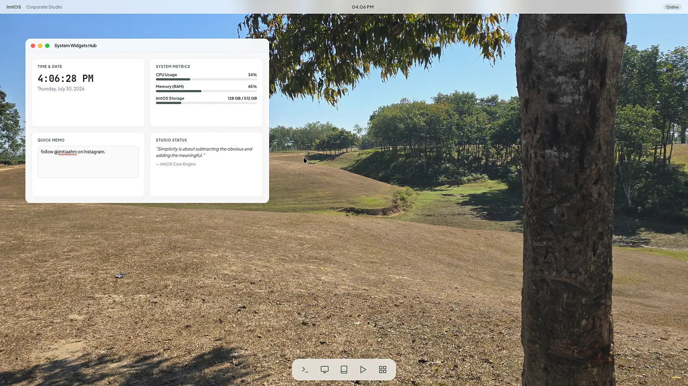
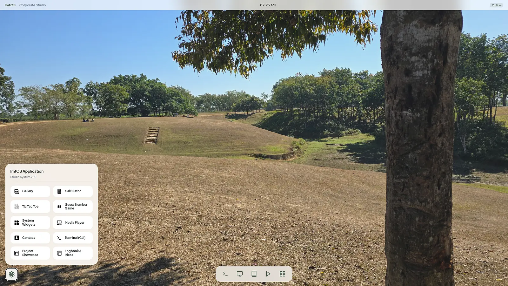
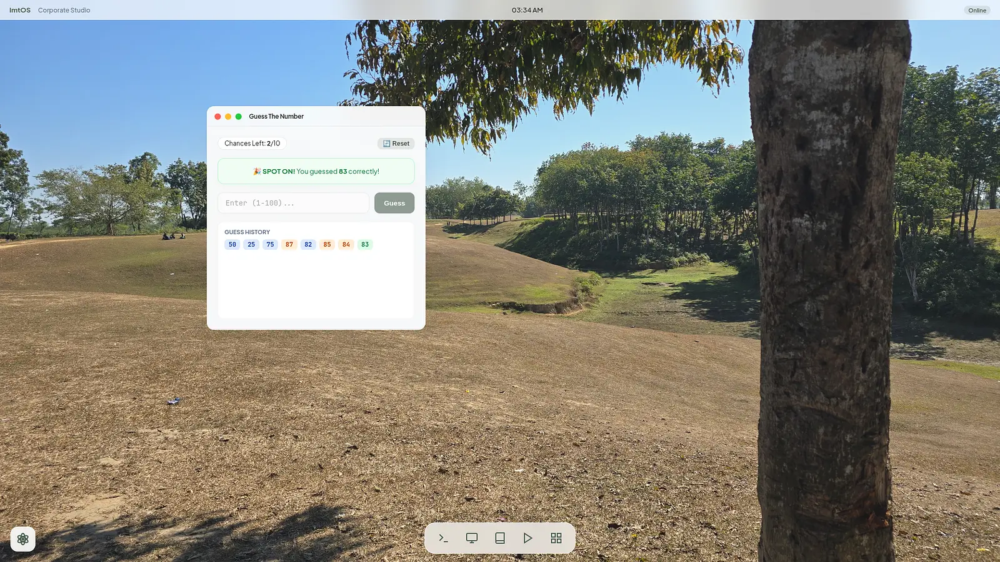
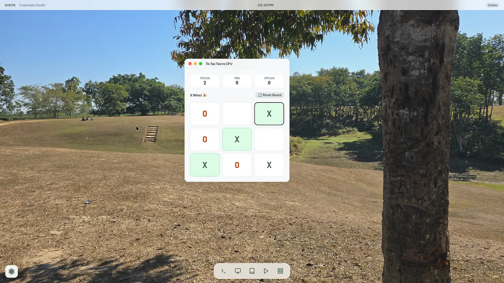

# 🪐 ImtOS - WebOS based on Imtiaz Ahmed

Hey, Welcome to the readme file of ImtOS. Here, I am gonna share my journey of how i made the ImtOS.

I am Imtiaz Ahmed, an developer from Bangladesh who has made multiple websites for shops around me. 
So, I have a little knowledge about HTML, CSS and JS.

So, In the journey of ImtOS, 

**1.** Created the index.html, which is the main frontend.
I made it show if its online, then it would show current time and those 5 apps in the dock.

**2.** Made the style.css file. 
In this OS, I used one of my photographys as a wallpaper. This is one of my favourites, coz i went to Sreemangal, Bangladesh in my weekend and took this photo as a memory.
It was already looking nice, but without any applications and softwares.

**3.** Created a window manager javascript file.
It will help me create any sized window in ImtOS without writing the same code again and again. I've tried to keep the aesthetics of MacOS here too.

**4.** Added terminal. 
In this terminal, i've added some easter eggs things.
Added these commands as commands.

**System Commands:**
- **whoami**   : Display user identity & role
- **bio**      : Personal background & story
- **projects** : Quick list of featured builds
- **photo**    : [Easter Egg] Reveal photograph
- **secret**   : [Easter Egg] System mystery
- **clear**    : Clear terminal screen

typing photo in the terminal would open a funny photoshop of me lol. :3
and typing secret would give you root access of ImtOS.

added them just for fun, they maybe dont make any sense lol.

**5.** Added Media Player.
This isn't actually a media player, coz it just runs some songs.
But I'll add a whole media feature in it in WebOS 2 Mission!

I added 22 Songs here, they are- 
- **American Boy** by Kanye West
- **Bad Habit** by Steve Lacy 
- **Bound 2** by Kanye West 
- **Chamber of Reflection** by Mac DeMarco 
- **Chicago** by Michael Jackson 
- **Confidence** by Kim
- **Dark Red** by Steve Lacy
- **Duvet** by Bôa
- **Flashing Lights** by Kanye West
- **For the First Time** by Mac DeMarco
- **From The Start** by Laufey
- **Ginseng Strip 2002** by Yung Lean
- **Headlock** by Imogen Heap
- **I Wonder** by Kanye West
- **Ice** by Zertal
- **Let it Happen** by Tame Impala
- **Like Him** by Tyler, The Creator
- **Lover Girl** by Laufey
- **New Person, Same Old Mistakes** by Tame Impala
- **See You Again** by Tyler, The Creator
- **Tek it** by Cafune
- **The Less I Know The Better** by Tame Impala

make sure to listen to them, they are my favs!

**6.** Added widget hub.
As it runs on website and its not actually an operating system, the system metrics is just a dumb data.
Other than that, it shows current time, data and day, a quote and a quick memo.
I also made the wallpaper crisp, coz why am i even adding a white layer in front of a natural picture?

**7.** Added application hub.
In the left bottom corner of the screen, i added an atom design taken from a sketchy website i forgot.
But it represents my interests towards chemistry too.
In that, i added 10 apps of ImtOS, used SVG icons for the apps to show.

**8.** Added Guess The Number game.
In this game, the computer decides a random number from 1 to 100.
The user or the player has to guess the number. To guess it correctly, after guessing one, the computer gives hints if the number is higher or lower than the number user guessed.
This game is very easy to play as the user gets 10 chances.

